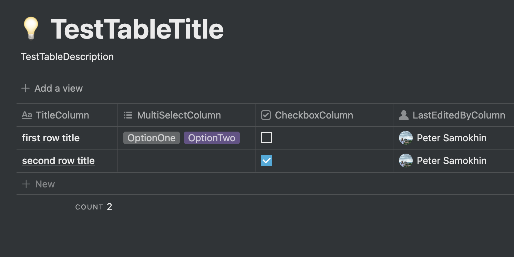

# Notion SDK / Kotlin Multiplatform


<p align="center">Use your Notion table as a data source.<br/>Export Notion pages as Markdown recursively.</p>

---

 [](https://developers.notion.com/changelog)
[](https://github.com/notionsdk/notion-sdk-kotlin/blob/master/LICENSE)

Not affiliated with Notion but uses the official API.<br>
The documentation is available here: https://developers.notion.com

### Installation
```kotlin
implementation("com.petersamokhin.notionsdk:notionsdk:$latestVersion")
```
Library is published to the Maven Central repository.

Latest version:  [](https://search.maven.org/search?q=g:com.petersamokhin.notionsdk)

### Supported endpoints
- [`/databases/:id/query`](https://developers.notion.com/reference/retrieve-a-database)
- [`/databases/:id`](https://developers.notion.com/reference/post-database-query)
- [`/blocks/:id/children`](https://developers.notion.com/reference/retrieve-a-block)
- [`/blocks/:id`](https://developers.notion.com/reference/get-block-children)

### Example usage - retrieve a database
How to get a token and the database ID: https://developers.notion.com/docs/getting-started



```kotlin
val notion = Notion.fromToken(
    token = "token",
    httpClient = HttpClient(CIO)
)

val schema = notion.retrieveDatabase("databaseId")
val database = notion.queryDatabase("databaseId")

val uncheckedRowSelectedOptionsIds = database.results
    .first { row ->
        val checkboxColumnSelected = (row.columns
            .getValue("CheckboxColumn")
            .value as NotionDatabaseProperty.Checkbox)
            .selected

        !checkboxColumnSelected
    }
    .columns.getValue("MultiSelectColumn")
    .let { column -> column.value as NotionDatabaseProperty.MultiSelect }
    .selected.map { option -> option.id }

val availableOptions = databaseInfo.schema.getValue("MultiSelectColumn")
    .let { property -> property as NotionDatabasePropertySchema.MultiSelect }
    .options

val uncheckedRowIgnoredOptionsNames = availableOptions
    .filter { option -> option.id !in uncheckedRowSelectedOptionsIds }
    .map { option -> option.name }

println(uncheckedRowIgnoredOptionsNames)
// Output:
// [OptionThree]

println(database)
// Output:
// NotionDatabase(
//    rows=[
//        NotionDatabaseRow(
//            columns={
//                MultiSelectColumn=NotionDatabaseColumn(key=MultiSelectColumn, value=MultiSelect(id=MWKa, selected=[])),
//                CheckboxColumn=NotionDatabaseColumn(key=CheckboxColumn, value=Checkbox(id=%5CUbj, selected=true)),
//                LastEditedByColumn=NotionDatabaseColumn(key=LastEditedByColumn, value=LastEditedBy(id=d%3EIW, lastEditedBy=User(id=UUID, name=Peter Samokhin, avatarUrl=https://site.com/whatever.png, email=contact+notionsdk@petersamokhin.com))), 
//                TitleColumn=NotionDatabaseColumn(key=TitleColumn, value=Title(id=title, text=second row title))
//            }
//        ),
//    
//        NotionDatabaseRow(
//            columns={
//                MultiSelectColumn=NotionDatabaseColumn(key=MultiSelectColumn, value=MultiSelect(id=MWKa, selected=[Option(id=UUID, name=OptionOne), Option(id=UUID, name=OptionTwo)])),
//                CheckboxColumn=NotionDatabaseColumn(key=CheckboxColumn, value=Checkbox(id=%5CUbj, selected=false)),
//                LastEditedByColumn=NotionDatabaseColumn(key=LastEditedByColumn, value=LastEditedBy(id=d%3EIW, lastEditedBy=User(id=UUID, name=Peter Samokhin, avatarUrl=https://site.com/whatever.png, email=contact+notionsdk@petersamokhin.com))), 
//                TitleColumn=NotionDatabaseColumn(key=TitleColumn, value=Title(id=title, text=first row title))
//            }
//        )
//    ],
//    nextCursor=null,
//    hasMore=false
// )
```

### Example usage - export a Notion page as markdown
How to get a token and the page (block) ID: https://developers.notion.com/docs/getting-started

```kotlin
val notion = Notion.fromToken(
    token = "token",
    httpClient = HttpClient(CIO)
)
val blocks: List<NotionBlock> = notion.retrieveBlockChildren("page-id").results

val exporter = NotionMarkdownExporter.create()

// the simplest way
val markdown: String = exporter.export(blocks = blocks)

// or a bit more complicated way
val markdown: String = exporter.exportRecursively(
    blocks = blocks,
    settings = Settings(), // please read the KDocs
    notion = notion,
    depthLevel = 3,
)
```

What is supported:
- All block types which have the content returned from the API (i.e. except the table of contents, etc.).
- Formatting
- Indentation for the children pages embedded content

What is NOT supported:
- HTML blocks like aside (callout), summary+details (spoiler aka toggle), font colors
- Many of other advanced blocks, they are simplified

### Purpose of the SDK
This library is intended to help with retrieving the info from the Notion databases and pages.<br>
Mostly, this is a handy tool which covers only the specific needs if you use Notion as a convenient data source.<br>
Also, it can help to migrate from Notion to any other tool by exporting the pages as Markdown.

### Feel free to contribute if you need some additional functionality